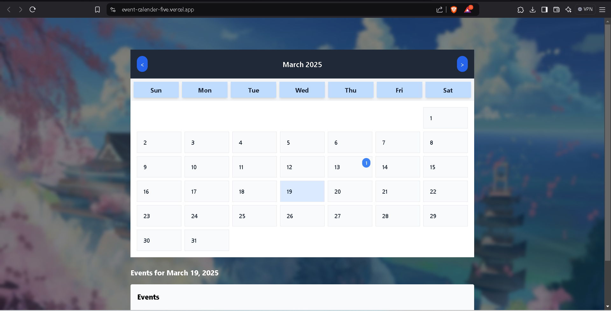

# Event Calendar

An interactive Event Calendar application built using **React**, **Vite**, and **TypeScript**. This project allows users to add events to any specific day and view them dynamically on a calendar grid.

## 🛠 Features

- 📅 Interactive calendar grid with days of the month.
- ➕ Add events to any specific day.
- 📝 View events for each day.
- 🖥 Built with **React**, **Vite**, and **TypeScript** for high performance and scalability.

## 🚀 Live Demo

Check out the live application here:  
[Event Calendar Live](https://event-calender-five.vercel.app)


## 📸 Preview

  


## 🧰 Tech Stack

- **Frontend Framework:** [React](https://reactjs.org/)  
- **Build Tool:** [Vite](https://vitejs.dev/)  
- **Programming Language:** [TypeScript](https://www.typescriptlang.org/)  
- **Styling:** [Tailwind CSS](https://tailwindcss.com/)

## 🛠 Installation and Setup

To run this project locally:

1. Clone the repository:
   ```bash
   git clone https://github.com/Sounabbhtchrzi/Event-Calender.git
   ```

2. Navigate to the project directory
  ```bash
  cd Event-Calender
  ```

3.Install dependencies
  ```bash
  npm install
  ```
4. Start the development server
 ```bash
 npm run dev
  ```

5. Open your browser and visit https://localhost:5173
